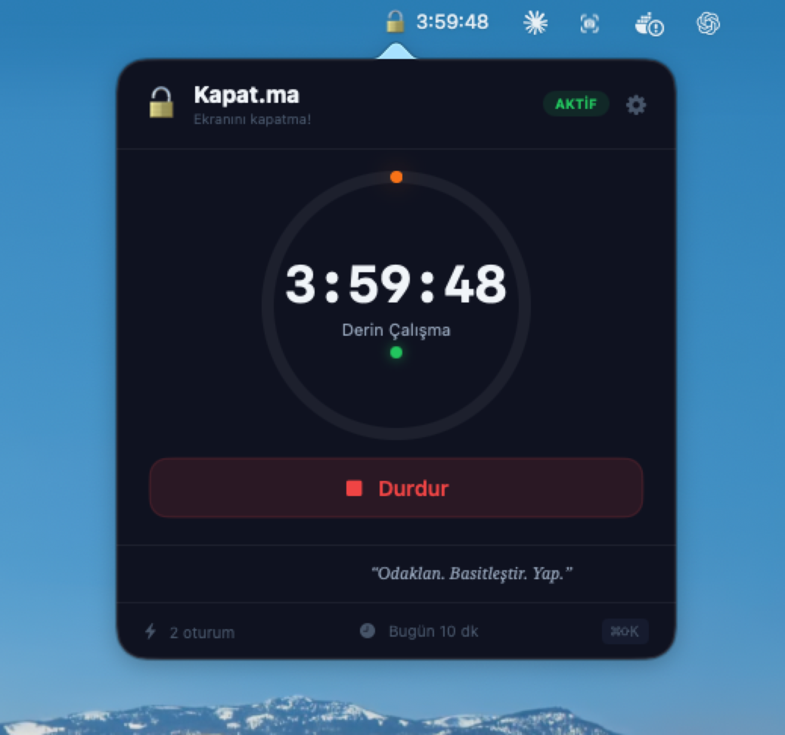
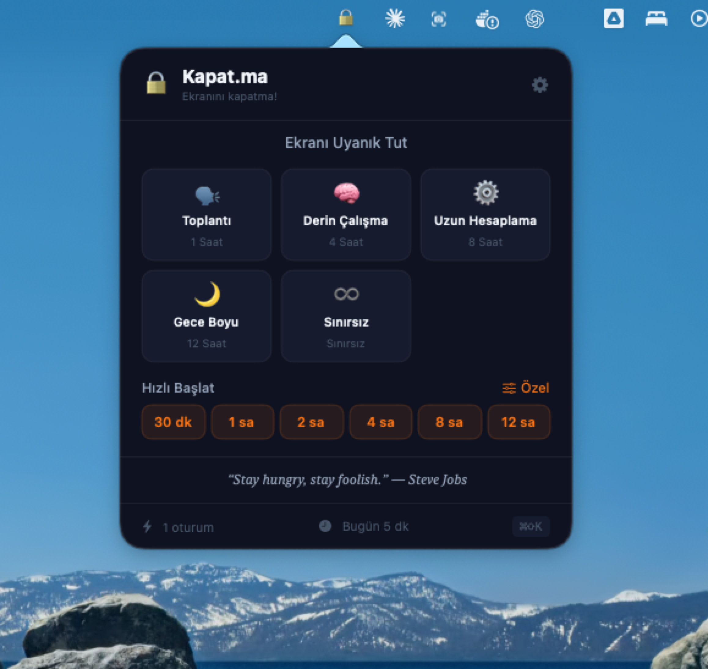
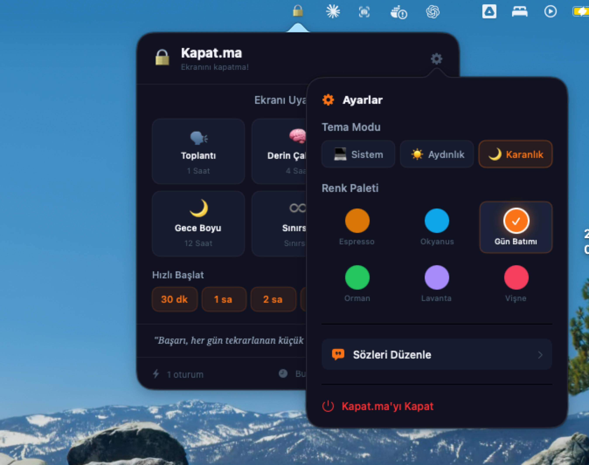

<p align="center">
  
</p>

<h1 align="center">Kapat.ma</h1>

<p align="center">
  <strong>Keep your Mac awake, beautifully.</strong><br>
  A sleek macOS menu bar app that prevents your screen from sleeping.
</p>

<p align="center">
  
  
  
  
</p>

---

## Screenshots

<p align="center">
  
  &nbsp;&nbsp;
  
  &nbsp;&nbsp;
  
</p>

<p align="center">
  <em>Main View &bull; Settings & Themes &bull; Active Session with Countdown</em>
</p>

---

## Features

### Menu Bar Integration
- Lives in your menu bar with a clean icon
- **Locked** when inactive, **Unlocked + countdown** when active
- Zero dock clutter &mdash; no dock icon, no windows

### 5 Built-in Profiles

| Profile | Duration | Use Case |
|---------|----------|----------|
| Meeting | 1 hour | Quick calls & meetings |
| Deep Work | 4 hours | Focused coding sessions |
| Long Compute | 8 hours | Builds, renders, ML training |
| Overnight | 12 hours | Long-running tasks |
| Unlimited | Infinite | Until you say stop |

### Quick Start Presets
One-click duration buttons: **30m, 1h, 2h, 4h, 8h, 12h**

### Custom Duration
Slider-based picker from **30 minutes to 24 hours** with half-hour steps.

### Theme System
- **3 Modes:** System (auto), Light, Dark
- **6 Color Palettes:** Espresso, Ocean, Sunset, Forest, Lavender, Cherry
- All UI elements adapt to the selected theme
- Automatically follows macOS appearance

### Motivational Quotes
- Rotating quotes every 10 seconds
- 12 built-in quotes (Turkish & English)
- Add your own custom quotes
- Tap to skip to the next quote

### Smart Notifications
- **5-minute warning** before session ends
- **Completion notification** when time is up

### Session Stats
- Daily session count
- Total active minutes today
- Resets automatically each day

### Keyboard Shortcut
Toggle the popover from anywhere with **`Cmd + Shift + K`**

---

## How It Works

Kapat.ma uses the native macOS `caffeinate` command under the hood to prevent your Mac from sleeping. It runs as a lightweight menu bar app with no dock presence, keeping your workflow clean and distraction-free.

---

## Requirements

- macOS 13.0+ (Ventura or later)
- Xcode 15.0+

## Installation

1. Clone the repository:
   ```bash
   git clone https://github.com/AriDavut662/KapatMa.git
   ```

2. Open the project in Xcode:
   ```bash
   cd KapatMa
   open KapatMa.xcodeproj
   ```

3. Build and run with **`Cmd + R`**

4. Look for the lock icon in your menu bar

> **Note:** App Sandbox must be disabled for `caffeinate` to work. This is already configured in the project settings.

---

## Project Structure

```
KapatMa/
├── KapatMaApp.swift          # App entry point + menu bar setup
├── CaffeineManager.swift     # caffeinate process management
├── QuotesManager.swift       # Motivational quotes engine
├── ThemeManager.swift        # Theme & color palette system
├── MainPopoverView.swift     # All UI views (main, settings, quotes editor)
├── Info.plist                # App configuration (LSUIElement = true)
├── KapatMa.entitlements      # Sandbox disabled
└── Assets.xcassets/          # App icons & colors
```

---

## Tech Stack

| Technology | Purpose |
|-----------|---------|
| **SwiftUI** | User interface |
| **AppKit** | Menu bar integration (NSStatusItem, NSPopover) |
| **caffeinate** | Native macOS sleep prevention |
| **UserDefaults** | Settings & stats persistence |
| **UNUserNotificationCenter** | Timer notifications |

---

## License

This project is licensed under the MIT License. See the [LICENSE](LICENSE) file for details.

---

<p align="center">
  Made with <strong>Swift</strong> on macOS
</p>
